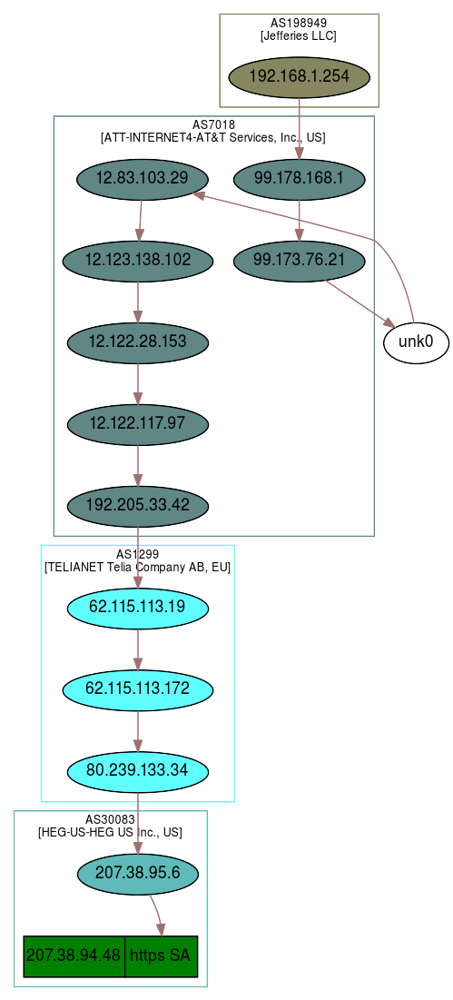
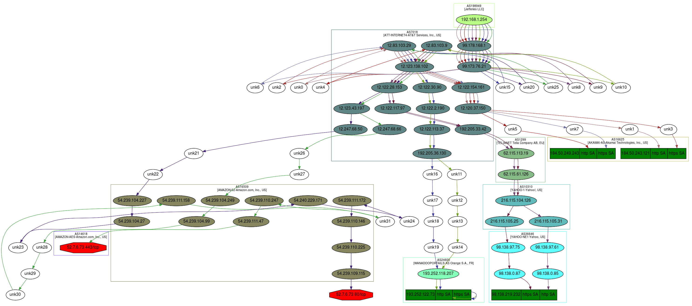

## Welcome to class 6!

### Black Hat Python3 

### Raleigh ISSA

---

## Github repo

https://github.com/tiarno/bhp3_class

---

## Summary from last class
 
- scapy w/graphics
- bpf
- arp watch/poison
- three-way handshake
- named tuples

---

## Graphics

```python
res, unans = traceroute(['reachtim.com'], dport=[443], maxttl=20, retry=-2)

res.graph()
```

---



---

```python
hosts = [
    'www.microsoft.com', 'www.cisco.com', 
    'www.yahoo.com', 'www.wanadoo.fr', 
    'www.pacsec.com']

res, unans = traceroute(hosts, dport=[80,443], maxttl=20, retry=-2)
res.graph()
```

---



---

```python
a = Ether()/IP(dst="www.slashdot.org")/TCP()/"GET /index.html HTTP/1.0 \n\n"
a[0].pdfdump(layer_shift=1)
```

---


---

## Three-way Handshake

- on client (Kali):
    - `iptables -t filter -I OUTPUT -p tcp --sport 10000 --tcp-flags RST RST -j DROP`
    - `tcpdump -ni any port 8000 -S`

- on server:
    - `python2 -m SimpleHTTPServer`
    - `python3 -m http.server`

---


```python
me, sport = '192.168.1.104', 10000
them, dport = '192.168.1.69', 8000
#
ip = IP(src=me, dst=them)
syn = TCP(sport=sport, dport=dport, flags='S', seq=1000)
synack = sr1(ip/syn)
ack = TCP(sport=sport, dport=dport, flags='A', seq=synack.ack, ack=synack.seq+1)
send(ip/ack)
```


---

## ARP Poison Program

`arper.py`

---

## DNS Spoofing:

https://thepacketgeek.com/scapy-p-09-scapy-and-dns/

`dns_spoof.py`

---

## Extract content from pcap file

`recapper.py`


---

## Demo: Identify Faces

`kali:/Desktop/bhp3/chapter04`

`detector.py`

---

## Scapy quick takes

- ping of death
``` 
send( fragment(IP(dst="192.168.1.104")
               /ICMP()/("X"*60000)) )
```
- ack scan
```
ans, unans = sr(IP(dst="www.slashdot.org")
                /TCP(dport=[80,666],flags="A"))
```
- Xmas packet
```
ans, unans = sr(IP(dst="192.168.1.1")
                /TCP(dport=666,flags="FPU") )
```

---

- ARP ping
```
ans, unans = srp(Ether(dst="ff:ff:ff:ff:ff:ff")
                 /ARP(pdst="192.168.1.0/24"),timeout=2)
```
- ICMP ping
```
ans, unans = sr(IP(dst="192.168.1.1-254")
                /ICMP())
```
- TCP ping
```
ans, unans = sr( IP(dst="192.168.1.*")
                 /TCP(dport=80,flags="S") )
```
- UDP ping
```
ans, unans = sr( IP(dst="192.168.*.1-10")
                 /UDP(dport=0) )
```

---

- TCP SYN traceroute
```
ans, unans = sr(IP(dst="4.2.2.1",ttl=(1,10))
                /TCP(dport=53, flags="S"))
```
- UDP traceroute
```
res, unans = sr(IP(dst="target", ttl=(1,20))
                /UDP()/DNS(qd=DNSQR(qname="test.com"))
```

---

## Your Job

- write your own arp poison tool
- experiment with graphics and scapy
- write your own pcap extraction tool
- examine code for scapy.arpcachepoison


---

## Reading

- Slides: http://www.secdev.org/conf/scapy_hack.lu.pdf
- Refer: https://scapy.readthedocs.io/en/latest/index.html
- Explore:  https://github.com/DanMcInerney
- Explore: https://github.com/0x90/uberscapy

---


## Feedback please!

- tim@reachtim.com
- discord: https://discord.gg/WR23qUj

 